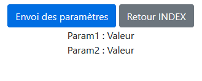
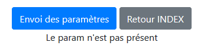

# PHP - Les paramètres d'URL

**Pour les exercices qui suivent** :   
- Bien respecter *les normes W3C*.  
- Ne pas oublier le CSS et ajouter une touche de *Bootstrap* dans vos exercices ... ou pas ... !  

## Exercice 1
Voici l'URL à étudier :  
> **index.php?lastname=Tutor&firstname=Janine**

Faire une page **index.php**.  
Sur cette page faire 2 boutons :
- Le premier "bouton" doit contenir un **href** qui pointe vers l'URL. Il faut ensuite tester sur *cette même page* que tous les paramètres existent :
    - S'ils sont présents les afficher.
    - Dans le cas contraire ne rien afficher.
- Le deuxieme "bouton" doit permettre de revenir à la page **index.php**.  

Boutons :  
  

Affichage :  
  

## Exercice 2

Voici l'URL à étudier :  
> **index.php?lastname=PARKER&firstname=Parker**

Faire une page **index.php**.  
Sur cette page faire 2 boutons :
- Le premier "bouton" doit contenir un **href** qui pointe vers l'URL. Il faut ensuite tester sur *cette même page* que le paramètre **age** existe :
    - S'il est présent, l'afficher.
    - Dans le cas contraire, mettre un message : *"il manque le paramètre **age**"*.
- Le deuxieme "bouton" doit permettre de revenir à la page **index.php**.  

Affichage :  
 

## Exercice 3
Voici l'URL à étudier :  
> **index.php?startDate=01/09/2019&endDate=17/03/2020**

Faire une page **index.php**.  
Sur cette page faire 2 boutons :
- Le premier "bouton" doit contenir un **href** qui pointe vers l'URL. Il faut ensuite tester sur *cette même page* que tous les paramètres existent :
    - S'ils sont présents, les afficher.
    - Dans le cas contraire ne rien afficher.
- Le deuxieme "bouton" doit permettre de revenir à la page **index.php**.  

## Exercice 4
Voici l'URL à étudier :  
> **index.php?language=PHP&server=WAMP**

Faire une page **index.php**.  
Sur cette page faire 2 boutons :
- Le premier "bouton" doit contenir un **href** qui pointe vers l'URL. Il faut ensuite tester sur *cette même page* que tous les paramètres existent :
    - S'ils sont présents, les afficher.
    - Dans le cas contraire ne rien afficher.
- Le deuxieme "bouton" doit permettre de revenir à la page **index.php**.  

## Exercice 5
Voici l'URL à étudier :  
> **index.php?week=12**

Faire une page **index.php**.  
Sur cette page faire 2 boutons :
- Le premier "bouton" doit contenir un **href** qui pointe vers l'URL. Il faut ensuite tester sur *cette même page* que tous les paramètres existent :
    - S'ils sont présents, les afficher.
    - Dans le cas contraire ne rien afficher.
- Le deuxieme "bouton" doit permettre de revenir à la page **index.php**.  

## Exercice 6
Voici l'URL à étudier :  
> **index.php?building=12&room=101**

Faire une page **index.php**.  
Sur cette page faire 2 boutons :
- Le premier "bouton" doit contenir un **href** qui pointe vers l'URL. Il faut ensuite tester sur *cette même page* que tous les paramètres existent :
    - S'ils sont présents, les afficher.
    - Dans le cas contraire ne rien afficher.
- Le deuxieme "bouton" doit permettre de revenir à la page **index.php**. 